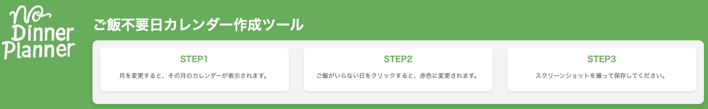

# No Dinner Planner

## ご飯不要日カレンダー作成ツール

「No Dinner Planner」は、特定の日に「ご飯が不要な日」をカレンダーに設定し、その情報を元にスクリーンショットを撮って保存するためのツールです。ユーザーは月を選択し、ご飯が不要な日をクリックして記録することができます。

## 機能

- **年度と月を選択**: 年度と月を選択して、その年の月のカレンダーを表示
- **ご飯不要日設定**: 特定の日にご飯不要を設定すると、その日は赤色で表示される
- **スクリーンショット機能**: カレンダーのスクリーンショットを撮って保存

## 使用方法

1. 年度選択ボックスで年を選択します。
2. 月選択ボックスで月を選択すると、その月のカレンダーが表示されます。
3. カレンダーの日付をクリックすると、その日が赤色で表示され、「ご飯不要日」として設定されます。
4. スクリーンショットを撮って保存してください（スクリーンショットの方法は使用方法によって、異なります）。

## ライセンス

このプロジェクトはMITライセンスのもとで提供されています。詳細については、[LICENSE](LICENSE) ファイルをご覧ください。

## ご意見

ご意見やフィードバックは[こちらのフォーム](https://forms.gle/PP5CBit5WBcKDC8t7)からお願いします。